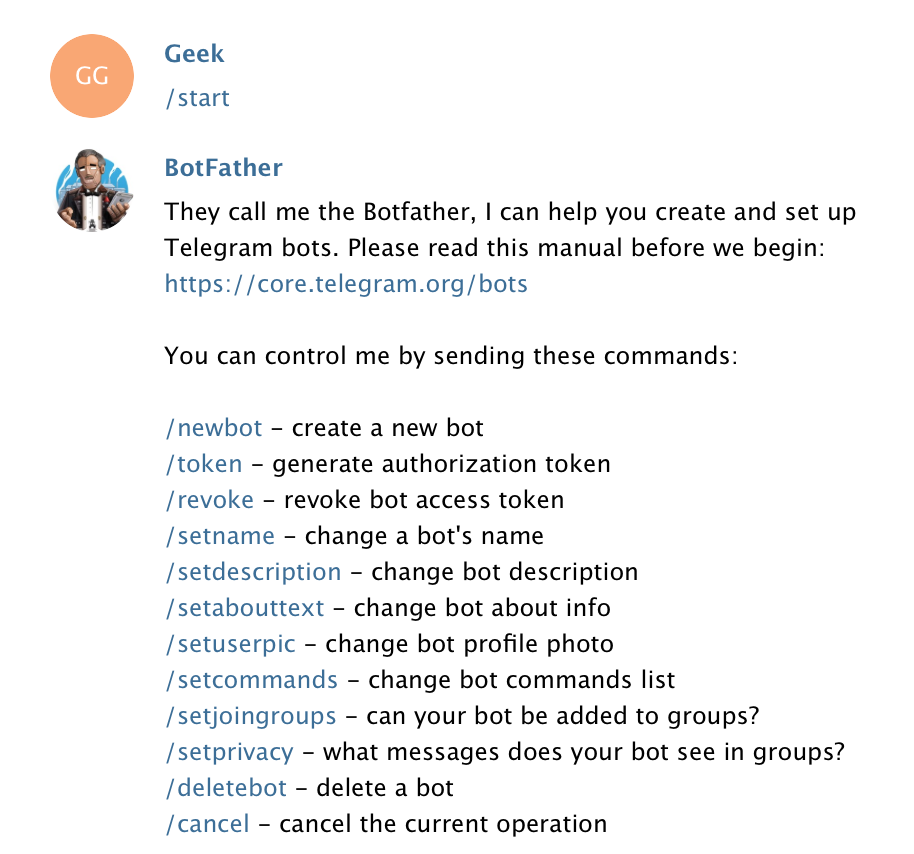

# M-PESA Telegram Bot

M-PESA telegram bot server in node.js using webhook.

## Installation

To install:

Download the Zip file

```bash
npm install
```
This assumes you are using [npm](https://www.npmjs.com/) as your package manager.

If you don’t, you can access these files on [npmcdn](https://npmcdn.com/telegram-node-bot/), download them, or point your package manager to them.

## Getting Started


First of all you need to create your bot and get Token, you can do it right in telegram, just write to @BotFather.



To test in a local environment you need to create a `.env` file in the root directory of the project and run heroku local

To run online you need to set a couple of config vars with `heroku config:set TOKEN=youmustputherethebottoken` and `heroku config:set HEROKU_URL=$(heroku info -s | grep web-url | cut -d= -f2)`

## License

Permission is hereby granted, free of charge, to any person obtaining a copy of this software and associated documentation files (the "Software"), to deal in the Software without restriction, including without limitation the rights to use, copy, modify, merge, publish, distribute, sublicense, and/or sell copies of the Software, and to permit persons to whom the Software is furnished to do so, subject to the following conditions:

The above copyright notice and this permission notice shall be included in all copies or substantial portions of the Software.

THE SOFTWARE IS PROVIDED "AS IS", WITHOUT WARRANTY OF ANY KIND, EXPRESS OR IMPLIED, INCLUDING BUT NOT LIMITED TO THE WARRANTIES OF MERCHANTABILITY, FITNESS FOR A PARTICULAR PURPOSE AND NONINFRINGEMENT. IN NO EVENT SHALL THE AUTHORS OR COPYRIGHT HOLDERS BE LIABLE FOR ANY CLAIM, DAMAGES OR OTHER LIABILITY, WHETHER IN AN ACTION OF CONTRACT, TORT OR OTHERWISE, ARISING FROM, OUT OF OR IN CONNECTION WITH THE SOFTWARE OR THE USE OR OTHER DEALINGS IN THE SOFTWARE.
